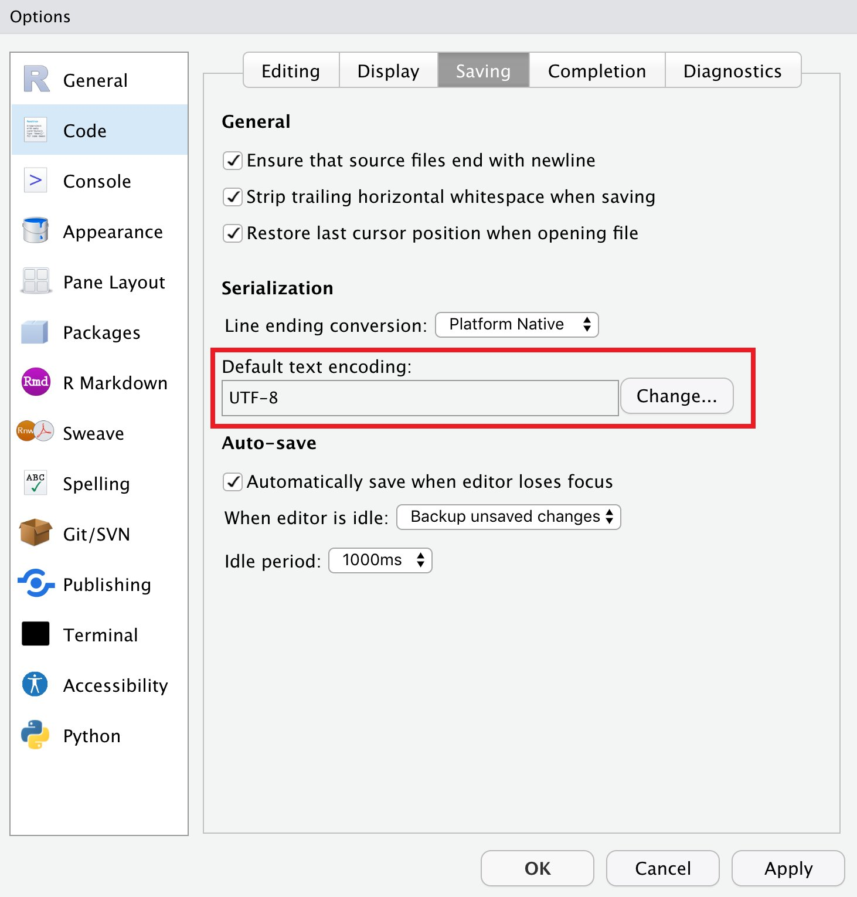
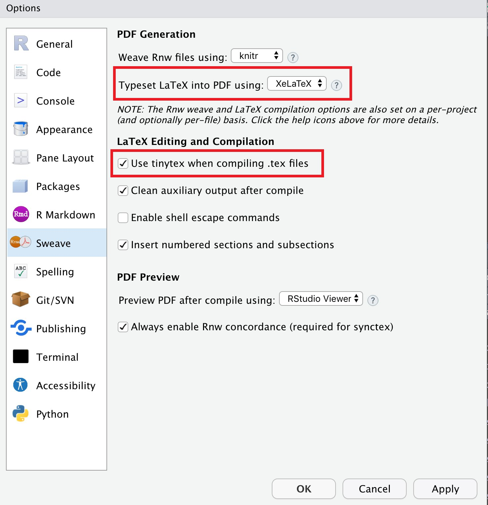
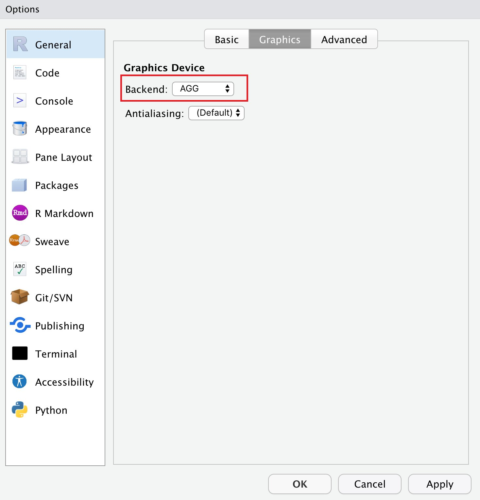
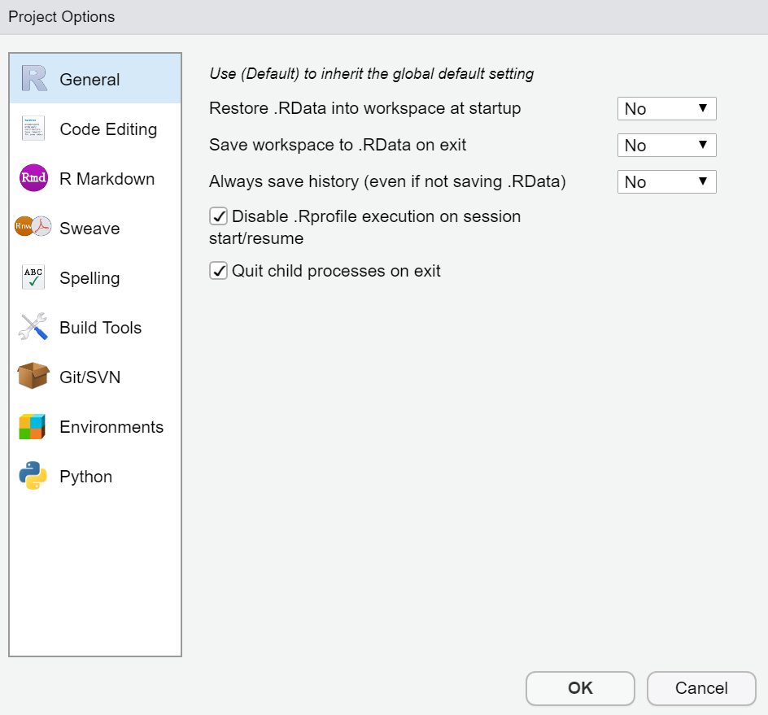

# Coding Standards for R

We will follow the <https://style.tidyverse.org/> style guide with very few changes to benefit from two R packages supporting this style guide:

- [`{styler}`](http://styler.r-lib.org/)
- [`{lintr}`](https://github.com/jimhester/lintr)

This coding standards will outline the more important aspects of the aforementioned style.

# Modifications from tidyverse Coding Standards

- Naming will use `camelCase` instead of `snake_case`.

- Favor usage of `return()` even when the return value does not need to be specified explicitly.

# RStudio IDE Settings

- Indentation of 2

- Use spaces instead of tabs

- Use UTF-8 text encoding (Ref: <https://yihui.org/en/2018/11/biggest-regret-knitr/>)



- Use `{tinytex}` for `LaTeX` compilation (Ref: <https://yihui.org/tinytex/pain/>)



- Use AGG graphics device (Ref: <https://www.tidyverse.org/blog/2021/02/modern-text-features/>)



- Use a blank slate (there should not be any residue from previous session when you start a new session to ensure long-term reproducibility of the software)



# Naming Convention

Use meaningful and understandable names. Code should read as a story and only some well known abbreviations (such as pk) should be used.

## Files

File names containing both source code (`/R`) and tests (`/tests`) should follow the kebab-case naming convention and should have `.R` extension.

```r
# bad
DataCombined.R
test-DataCombined.R

# good
data-combined.R
test-data-combined.R
```

## Object names

- Variable and function names should use only lowercase letters and numbers. Use **camelCase** to separate words within a name.

- Class names on the other hand should use **Pascal Casing**.

- True constant variables should use **ALL_CAPS Casing**.

```r
# Class

Parameter <- R6Class("Parameter", ....)

# Variable

parameterToDelete <- ...

# Method and function

performSimulation <- function (...)

# Constant variables

DEFAULT_PERCENTILE <- 0.5
```

- Do not use Hungarian notation (e.g., g for global, b for Boolean, s for strings, etc.)

## Functions

Prefer using `return()` for explicitly returning result, although you can rely on R to implicitly return the result of the last evaluated expression in a function.

## Comments

- Do not comment the obvious.
- Use comments to explain the **why**, and not the **what** or **how**.
- Indent comment at the same level of indentation as the code you are documenting.
- All comments must be written in English.
- Do not generate comments automatically.
- Do comment algorithm specifics. For example, why would you start a loop at index 1 and not at 0, etc.
- If a lot of comments are required to make a method easier to understand, break down the method in smaller methods.
- Really, do not comment the obvious.

## Documentation

- Use roxygen comments (`#'`) as described [here](http://r-pkgs.had.co.nz/man.html#roxygen-comments).

- Do not include empty lines between the function code and its documentation.

```r
# Good
#' @export
weekend <- list("Saturday", "Sunday")

# Bad
#' @export

weekend <- list("Saturday", "Sunday")
```

- Internal functions, if documented, should use the tag `#' @keywords internal`. This makes sure that package websites don't include these internal functions.

- Prefer using `markdown` syntax to write roxygen documentation (e.g. use `**` instead of `\bold{}`).

- To automate the conversion of existing documentation to use `markdown` syntax, install [roxygen2md](https://roxygen2md.r-lib.org/) package and run `roxygen2md::roxygen2md()` in the package root directory and carefully check the conversion.

## Conventions

- Function names as code with parentheses (good: `dplyr::mutate()`, `mutate()`; bad: *mutate*, **mutate**)
- Variable and (`R6`/`S3`/`S4`) object names as code (good: `x`; bad: x, *x*, **x**)
- Package names as code with `{` (good: `{dplyr}`; bad: `dplyr`, *dplyr*, **dplyr**)
- Programming language names as code (e.g. `markdown`, `C++`)

Note that these conventions are adopted to facilitate (auto-generated) cross-linking in `{pkgdown}` websites.

### Documenting functions

<http://r-pkgs.had.co.nz/man.html#man-functions>

### Documenting classes

Reference classes are different across `S3` and `S4` because methods are associated with classes, not generics. RC also has a special convention for documenting methods: the docstring. The docstring is a string placed inside the definition of the method which briefly describes what it does. This makes documenting RC simpler than `S4` because you only need one roxygen block per class.

```r
#' This is my Person class
#' @title Person Class
#' @docType class
#' @description Person class description
#' @field name Name of the person
#' @field hair Hair colour
#'
#' @section Methods:
#' \describe{
#' \item{set_hair Set the hair color}
#' }
#'
#' @examples
#' Person$new(name="Bill", hair="Blond")
#' @export
Person <- R6::R6Class("Person",
  public = list(
    name = NULL,
    hair = NULL,
    initialize = function(name = NA, hair = NA) {
      self$name <- name
      self$hair <- hair
    },

    set_hair = function(val) {
      self$hair <- val
    },
  )
)
```

When referring to the class property (`$name`) or method (`$set_hair()`) in package vignettes, use the `$` sign to highlight that they belong to an object. Note that the method always has parentheses to distinguish it from a property.

If a class has a private method, its name should start with `.` to highlight this (e.g. `$.set_hair_color()`).

# Syntax

## Spacing

Use the `styler` addin for RStudio. It will style the files for you. For more, see [here](https://style.tidyverse.org/syntax.html#spacing)

## Global Variables

- Except for program constants or truly global states, never use global variables. If a global object is required, this should be absolutely discussed with the team.

- No hard coded strings and magic number should be used. Declare a constant instead.

## Booleans

- Avoid using boolean abbreviations (`T` and `F`). Instead, use `TRUE` and `FALSE` (respectively).

## Style

### Long Lines

Strive to limit your code (including comments and roxygen documentation) to 80 characters per line.

### Assignments

Use `<-`, not `=`, for assignment.

### Semicolons

Don't put `;` at the end of a line, and don't use `;` to put multiple commands on one line.

**Note:** All these styling issues, and much more, are corrected automatically with `{styler}`.

### Code blocks

- `{` should be the last character on the line. Related code (e.g., an `if` clause, a function declaration, a trailing comma, etc.) must be on the same line as the opening brace.

- The contents should be indented.

- `}` should be the first character on the line.

- It is OK to drop the curly braces for very simple statements that fit on one line, **as long as they don't have side-effects**.

```r
# Good
y <- 10
x <- if (y < 20) "Too low" else "Too high"

# Bad
if (y < 0) stop("Y is negative")

if (y < 0)
  stop("Y is negative")

find_abs <- function(x) {
  if (x > 0) return(x)
  x * -1
}
```

# Tests

Refer to chapter [Tests](https://style.tidyverse.org/tests.html)

# Error messages

Refer to chapter [Errors](https://style.tidyverse.org/error-messages.html)

# Rmarkdown

Package vignettes are written using `{rmarkdown}` package. Here are some good practices to follow while writing these documents:

- It is strongly recommended that only alphanumeric characters (`a-z`, `A-Z` and `0-9`) and dashes (`-`) are used in chunk labels, because they are not special characters and will surely work for all output formats. Other characters, spaces and underscores in particular, may cause trouble in certain packages, such as `{bookdown}`, `{styler}`. 
Ref: <https://bookdown.org/yihui/rmarkdown/r-code.html>

````
# bad

```{r load theme, echo=FALSE}
```

# good

```{r load-theme, echo=FALSE}
```
````

- Let your rmarkdown breathe. You should use blank lines to separate different elements to avoid ambiguity.
Ref: <https://yihui.org/en/2021/06/markdown-breath/>


````
# bad -----------------

My line is right above my chunk.
```{r}
```
# and the next section right below

# good -----------------

There is a line between text and chunk.

```{r}
```

# and the next section is separated by line as well
````

# See also

A more comprehensive list of tools helpful for package development can be found in this [resource](https://github.com/IndrajeetPatil/awesome-r-pkgtools/blob/master/README.md).
