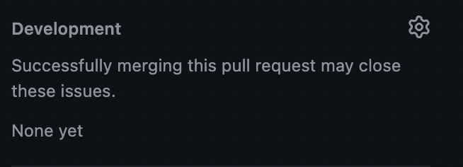
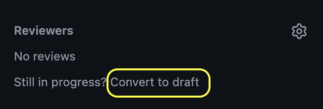

# Pull Request and Code Review Guidelines

-   Unless it's a trivial change (spelling mistake, code formatting, etc.), there should be an existing issue that will be closed by the given PR.

-   The branch name from which PR is being made should follow the convention: \`\<issue_number\>-short*-*description\`.

-   The title for the PR should provide a brief description about the changes.

-   The PR should be linked to the issue(s) that it targets, either by using keywords (like `fixes`, `closes`, etc.) in the PR description or by using \`development\` feature.

    

-   Even if the PR doesn't close any issues, it should refer to the comment or discussion that inspired it. Lacking any of these, the PR description should be self-sufficient to explain the motivation for the PR.

-   If the PR is a work in progress, you can convert it to a draft PR and add \`WIP\` to the PR title.

    

-   Reviewers should not conduct code review of draft PRs, unless otherwise requested by the contributors.

-   Once the PR is marked as "Ready for Review", contributors should remember to remove \`WIP\` from the PR title.

-   Before marking the PR as "Ready for Review", contributors should also try their best to make sure that they are following the organization's [coding standards](https://github.com/Open-Systems-Pharmacology/Suite/blob/develop/CODING_STANDARDS.md).

-   Ideally, there should be a one-to-one mapping of issues to PR, although if a number of issues are related to the same underlying functionality, it is completely acceptable to address multiple issues in a single PR.

-   Reviewers should do their due diligence to understand the underlying issue, instead of asking contributors to reiterate the details that have already been outlined in GitHub Issues/Discussions.

-   The responsibility of resolving code review comments falls squarely on the reviewers. The contributors shouldn't themselves resolve the review comments, even if they are 100% confident that their latest commits address review comments.

-   Code review comments should strictly follow the ethical decorum stipulated by [Code of Conduct](https://github.com/Open-Systems-Pharmacology/Suite/blob/develop/CODE_OF_CONDUCT.md).

-   Reviewers should refrain from making remarks that can potentially be construed as hurtful or dismissive by contributors (e.g. "LOL, this doesn't work", "LMAO, what the hell is this?!", etc.). The comments should be constructive, irrespective of whether they are terse or detailed.

-   Even if contributors possess the right to merge PRs to protected branches without code review, they should exercise this power responsibly and try their best not to circumvent the "number of required reviews" condition stipulated for the protected branch.
