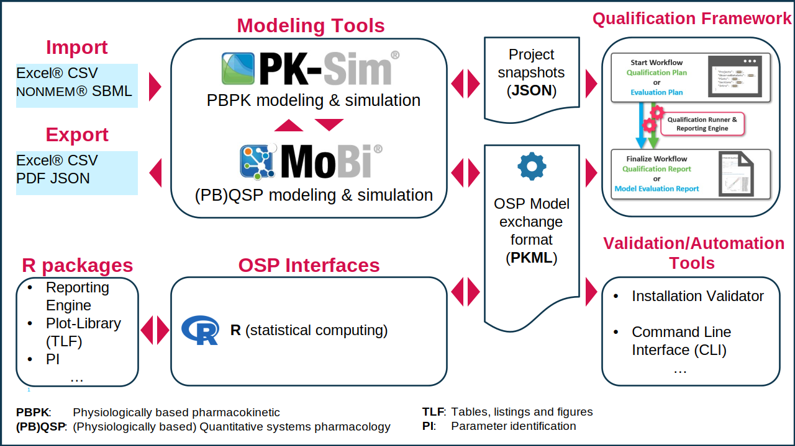

This open source Systems Pharmacology project makes formerly commercial software tools [PK-Sim®](http://www.open-systems-pharmacology.org/pk-sim) and [MoBi®](http://www.open-systems-pharmacology.org/mobi) available as freeware under the [GPLv2 License](LICENSE). All source code is public. 

Latest suite release can be found here:
http://setup.open-systems-pharmacology.org

We invite everyone in the field of Systems Pharmacology, be it in academia, industry or regulatory bodies, to use the platform. Active participation of computer and modeling & simulation scientists in the further development of the modeling & simulation platform, the incorporated systems models, processes for their qualifaction and application etc. is encouraged and highly welcome! Please follow the community’s activities in this GitHub project.

# Discussion forum for the Open Systems Pharmacology Project
Visit and subscribe to the [Open Systems Pharmacology Project Forum](http://forum.open-systems-pharmacology.org) to stay up-to-date with the community and receive updates on new software releases, models as well as discussions.

# Open Systems Pharmacology Suite with PK-Sim® and MoBi® for Quantitative Systems Pharmacology

## Unmatched Flexibility - Unlimited Transparency

The Open Systems Pharmacology Suite contains different software tools and has been designed using a modular concept to allow efficient multi-scale modeling and simulation. The overall platform with its various software tools is implemented in a modular way as will be explained in more detail below. 
The central software tools PK-Sim® and MoBi® make use of building blocks as introduced [here](https://docs.open-systems-pharmacology.org/open-systems-pharmacology-suite/modules-philsophy-building-blocks). 
While PK-Sim® is based on a whole-body concept, the focus of its counterpart, MoBi®, is at the molecular level. However, both tools extend to additional physiological scales as illustrated.

### PK-Sim
[PK-Sim®](https://docs.open-systems-pharmacology.org/working-with-pk-sim/pk-sim-documentation) is a comprehensive software tool for whole-body physiologically based pharmacokinetic modeling. It enables rapid access to all relevant anatomical and physiological parameters for humans and the most common laboratory animals (**mouse**, **rat**, **minipig**, **dog**, **monkey**, **beagle** and **rabbit**) that are contained in the integrated database. Moreover, access to different PBPK calculation methods to allow for fast and efficient model building and parameterization is provided. Relevant generic passive processes, such as distribution through blood flow as well as specific active processes such as metabolization by a certain enzyme are automatically taken into account by PK-Sim®. Like most PBPK modeling tools, PK-Sim® is designed for use by non-modeling experts and only allows for minor structural model modifications. Unlike most PBPK modeling tools though, PK-Sim® offers different model structures to choose from, e.g. to account for important differences between _small_ and _large_ molecules. More importantly, PK-Sim® is fully compatible with the expert modeling software tool MoBi®, thereby allowing full access to all model details including the option for extensive model modifications and extensions. This way customized systems pharmacology models may be set up to deal with the challenges of modern drug research and development.

PK-Sim® uses building blocks that are grouped into [**Individuals**](https://docs.open-systems-pharmacology.org/working-with-pk-sim/pk-sim-documentation/pk-sim-creating-individuals), [**Populations**](https://docs.open-systems-pharmacology.org/working-with-pk-sim/pk-sim-documentation/pk-sim-creating-populations), [**Compounds**](https://docs.open-systems-pharmacology.org/working-with-pk-sim/pk-sim-documentation/pk-sim-compounds-definition-and-work-flow), [**Formulations**](https://docs.open-systems-pharmacology.org/working-with-pk-sim/pk-sim-documentation/pk-sim-formulations), [**Administration Protocols**](https://docs.open-systems-pharmacology.org/working-with-pk-sim/pk-sim-documentation/pk-sim-administration-protocols), [**Events**](https://docs.open-systems-pharmacology.org/working-with-pk-sim/pk-sim-documentation/pk-sim-events), **Observers** and [**Observed Data**](https://docs.open-systems-pharmacology.org/shared-tools-and-example-workflows/import-edit-observed-data). Building blocks from these groups are combined to produce a [model](https://docs.open-systems-pharmacology.org/working-with-pk-sim/pk-sim-documentation/pk-sim-simulations). The advantage of building blocks is that they can be reused. For example, after having established a model for a drug after single dose intravenous administration to an animal species, just substitute the individual by a suitably parameterized virtual human population and obtain a first in man simulation model. Further substitute the formulation, to obtain a controlled-release per oral simulation model, substitute the protocol to obtain a multiple dose simulation model, or substitute the compound to obtain a simulation model for another drug. 

### MoBi
[MoBi®](https://docs.open-systems-pharmacology.org/working-with-mobi/mobi-documentation) is a systems biology software tool for multiscale physiological modeling and simulation. Within the restrictions of ordinary differential equations, almost any kind of (biological) model can be imported or set up from scratch. Examples include biochemical reaction networks, compartmental disease progression models, or PBPK models. However, de novo development of a PBPK model, for example, is very cumbersome such that the preferred procedure is to import them from PK-Sim®. Importantly, MoBi® also allows for the combination of the described examples and thereby is a very powerful tool for modeling and simulation of multi-scale physiological systems covering molecular details on the one hand and whole-body architecture on the other hand.

De novo model establishment and simulation is supported by graphical tools and building blocks to support expert users. MoBi® uses building blocks that are grouped into [**Molecules**](https://docs.open-systems-pharmacology.org/working-with-mobi/mobi-documentation/model-building-components#molecules), [**Reactions**](https://docs.open-systems-pharmacology.org/working-with-mobi/mobi-documentation/model-building-components#reactions), [**Spatial Structures**](https://docs.open-systems-pharmacology.org/working-with-mobi/mobi-documentation/model-building-components#spatial-structures), [**Passive Transports**](https://docs.open-systems-pharmacology.org/working-with-mobi/mobi-documentation/model-building-components#transport-processes), [**Observers**](https://docs.open-systems-pharmacology.org/working-with-mobi/mobi-documentation/model-building-components#observers), [**Events**](https://docs.open-systems-pharmacology.org/working-with-mobi/mobi-documentation/model-building-components#events-and-applications), [**Molecule Start Values**](https://docs.open-systems-pharmacology.org/working-with-mobi/mobi-documentation/model-building-components#molecule-start-values), [**Parameter Start Values**](https://docs.open-systems-pharmacology.org/working-with-mobi/mobi-documentation/model-building-components#parameter-start-values) and [**Observed Data**](https://docs.open-systems-pharmacology.org/shared-tools-and-example-workflows/import-edit-observed-data). Building blocks out of the above-mentioned groups can be combined to [generate models](https://docs.open-systems-pharmacology.org/working-with-mobi/mobi-documentation/setting-up-simulation). The advantage of building blocks is that they can be reused. Examples:

- a different set of starting values may define a new scenario, situation, or individual. 
- refine a Reaction(s) network and update it in all tissues where it should be considered.

### Qualification framework

The qualification framework enables an automated validation of various scenarios (use-cases) supported by the OSP platform. This technical framework is used, for example, to release, in full confidence, a new version of the OSP Suite by verifying automatically that an ever-growing list of scenarios is performing as expected. Qualification framework is described in detail [here](https://docs.open-systems-pharmacology.org/shared-tools-and-example-workflows/qualification).

### Validation and automation tools

Validation and automation tools include for example:

* **Installation Validator**: enables "1-Click" validation of the OSP Suite installation on a target computer. The validation is performed by execution of the predefined set of simulation scenarios and comparison of the simulated results with the (validated) reference values.
* **Command Line Interface** (*CLI*): allows batch processing of multiple projects in PK-Sim and is described in [Command Line Interface - CLI](https://docs.open-systems-pharmacology.org/working-with-pk-sim/pk-sim-documentation/pk-sim-command-line-interface).

### Toolboxes

The MoBi® toolbox for R is an interface to the common statistical computing environment. Basically, the R-toolbox can be used to access and modify model parameters as well as to execute simulations and retrieve results. That way, the R-toolbox can be used to script or code batch simulations, analysis tasks, or customized workflows to any complexity. Results can be visualized using the options available in the respective environment. The MoBi® toolbox for R is described in detail in [R documentation](https://docs.open-systems-pharmacology.org/working-with-r/r-introduction).

**OSP Qualification Framework and MoBi® toolbox for R are not included into the main OSP Suite setup and must be installed separately. Installation instructions are provided in the documentation of the tools.**

### OSP Model exchange format

Models created in PK-Sim® or MoBi® can be exported in *PK Modeling Language* (***.pkml**) format and shared between the OSP tools. Internally, PKML file format is nothing more than XML with a predefined structure.

### Import and Export

Apart from the communication and exchange via R, PK-Sim® and MoBi® have import and export functions for MS Excel®, CSV and NONMEM® that allow for the import of experimental data or the export of simulation results, for example.  MoBi® has SBML import functionalities. 
PK-Sim can also import and export *project snapshots* in [JSON format](https://en.wikipedia.org/wiki/JSON) (s. [Exporting Project to Snapshot](https://docs.open-systems-pharmacology.org/working-with-pk-sim/pk-sim-documentation/importing-exporting-project-data-models#exporting-project-to-snapshot-loading-project-from-snapshot) for details).

## Code Status

## Software installation

How to install setups for the Open Systems Pharmacology Suite with PK-Sim® and MoBi®

1. Download the [Software Setup](http://setup.open-systems-pharmacology.org) and install it on your computer. Make sure you are provided with administrator rights; these are required!
1. Download [PK-Sim Gene Expression Database(s)](http://setup.open-systems-pharmacology.org) and copy to a folder accessible for all users. 
1. Configure PK-Sim Gene Expression Database(s) (for details view the [Open Systems Pharmacology Suite manual](https://docs.open-systems-pharmacology.org/working-with-pk-sim/pk-sim-documentation/pk-sim-options))

## System Requirements

### Operating Systems (64 bit only)

#### OSP Suite 
Windows 7®, Windows 8®, Windows 10®, Windows Server 2008 R2®, Windows Server 2012 R2®, Windows Server 2016®, Windows Server 2019®

#### R-Toolbox

All Windows operating systems listed above and Linux (_precompiled_ packages available for _Ubuntu 18.04_ and _CentOS 7_)

### Processor
Minimum: 1 GHz (the faster the better!)

### Memory
Minimum: 2 GB RAM (3+ GB recommended)

### Disk Space
Minimum: 2 GB

### Optional Software
 * Matlab® (version 2017b or later)
 * R® (versions 3.5 / 3.6 - 64bit) 
   
## Code of conduct
Everyone interacting in the Open Systems Pharmacology community (codebases, issue trackers, chat rooms, mailing lists etc...) is expected to follow the Open Systems Pharmacology [code of conduct](https://github.com/Open-Systems-Pharmacology/Suite/blob/master/CODE_OF_CONDUCT.md).

## Contribution
We encourage contribution to the Open Systems Pharmacology community. Before getting started please read the [contribution guidelines](https://github.com/Open-Systems-Pharmacology/Suite/blob/master/CONTRIBUTING.md). If you are contributing code, please be familiar with the [coding standards](https://github.com/Open-Systems-Pharmacology/Suite/blob/master/CODING_STANDARDS.md).

All trademarks within this document belong to their legitimate owners.
